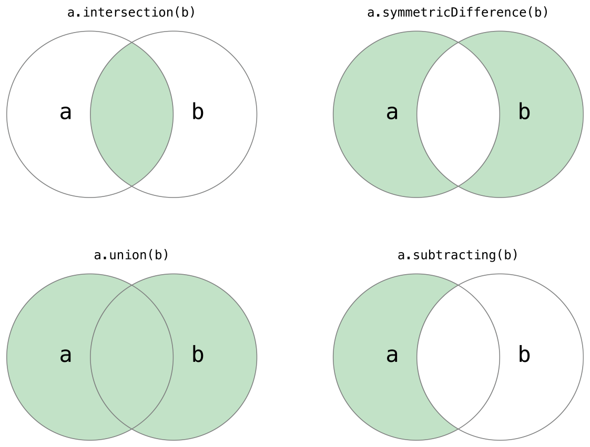

# swift Questions

1 - **Type Annotations**
- This example provides a type annotation for a variable called welcomeMessage, to indicate that the variable can store String values:
```swift
var welcomeMessage: String
```
2- **What is the difference between Int and UInt?**
- Swift provides signed and unsigned integers in 8, 16, 32, and 64 bit forms. These integers follow a naming convention similar to C, in that an 8-bit unsigned integer is of type UInt8, and a 32-bit signed integer is of type Int32. Like all types in Swift, these integer types have capitalized names.
- Signed Integer -> Int  
- Unsigned Integer -> UInt

> NOTE
>
> Use UInt only when you specifically need an unsigned integer type with the same size as the platform’s native word size. If this isn’t the case, Int is preferred, even when the values to be stored are known to be nonnegative. A consistent use of Int for integer values aids code interoperability, avoids the need to convert between different number types, and matches integer type inference, as described in Type Safety and Type Inference.

2- **Type Safety and Type Inference?**
- Swift uses `type inference` to work out the appropriate type. `Type inference` enables a compiler to deduce the type of a particular expression automatically when it compiles your code, simply by examining the values you provide.

3- **Optional Binding**
- You use optional binding to find out whether an optional contains a value, and if so, to make that value available as a temporary constant or variable. Optional binding can be used with if and while statements to check for a value inside an optional, and to extract that value into a constant or variable, as part of a single action.
```swift
if let constantName = someOptional {
    statements
}
```
4- **Implicitly Unwrapped Optionals**
- Sometimes it’s clear from a program’s structure that an optional will always have a value, after that value is first set. In these cases, it’s useful to remove the need to check and unwrap the optional’s value every time it’s accessed, because it can be safely assumed to have a value all of the time.

- These kinds of optionals are defined as `implicitly unwrapped optionals`. You write an implicitly unwrapped optional by placing an exclamation point (String!) rather than a question mark (String?) after the type that you want to make optional. Rather than placing an exclamation point after the optional’s name when you use it, you place an exclamation point after the optional’s type when you declare it.

5- **Assertions and Preconditions**
- Assertions and preconditions are checks that happen at runtime
- Assertions help you find mistakes and incorrect assumptions during development
- preconditions help you detect issues in production.


   
6- **Range Operators**
- **Closed Range Operator**
```swift
   for index in 1...5 {
       print("\(index) times 5 is \(index * 5)")
   }
```
- **Half-Open Range Operator** 
```swift
   let names = ["Anna", "Alex", "Brian", "Jack"]
   let count = names.count
   for i in 0..<count {
       print("Person \(i + 1) is called \(names[i])")
   }
```
- **One-Sided Ranges**
```swift
   for name in names[2...] {
       print(name)
   }

   for name in names[...2] {
       print(name)
   }
   
   for name in names[..<2] {
       print(name)
   }
   let range = ...5
```
7- **Strings Are Value Types**
- Swift’s String type is a value type. If you create a new String value, that String value is copied when it’s passed to a function or method, or when it’s assigned to a constant or variable. In each case, a new copy of the existing String value is created, and the new copy is passed or assigned, not the original version.

8- **String Interpolation**
- String interpolation is a way to construct a new String value from a mix of constants, variables, literals, and expressions by including their values inside a string literal. You can use string interpolation in both single-line and multiline string literals. Each item that you insert into the string literal is wrapped in a pair of parentheses, prefixed by a backslash (\):
```swift
let multiplier = 3
let message = "\(multiplier) times 2.5 is \(Double(multiplier) * 2.5)"
```

9- **Counting Characters**
- Note that Swift’s use of extended grapheme clusters for Character values means that string concatenation and modification may not always affect a string’s character count.
For example, if you initialize a new string with the four-character word cafe, and then append a COMBINING ACUTE ACCENT (U+0301) to the end of the string, the resulting string will still have a character count of 4, with a fourth character of é, not e:
```swift
var word = "cafe"
print("the number of characters in \(word) is \(word.count)")
// Prints "the number of characters in cafe is 4"

word += "\u{301}"    // COMBINING ACUTE ACCENT, U+0301

print("the number of characters in \(word) is \(word.count)")
// Prints "the number of characters in café is 4"
```
10- **String Indices**
- Each String value has an associated index type, String.Index, which corresponds to the position of each Character in the string.

As mentioned above, different characters can require different amounts of memory to store, so in order to determine which Character is at a particular position, you must iterate over each Unicode scalar from the start or end of that String. For this reason, Swift strings can’t be indexed by integer values.

Use the startIndex property to access the position of the first Character of a String. The endIndex property is the position after the last character in a String. As a result, the endIndex property isn’t a valid argument to a string’s subscript. If a String is empty, startIndex and endIndex are equal.

You access the indices before and after a given index using the index(before:) and index(after:) methods of String. To access an index farther away from the given index, you can use the index(_:offsetBy:) method instead of calling one of these methods multiple times.

You can use subscript syntax to access the Character at a particular String index.
```swift
let greeting = "Guten Tag!"
greeting[greeting.startIndex]
// G
greeting[greeting.index(before: greeting.endIndex)]
// !
greeting[greeting.index(after: greeting.startIndex)]
// u
let index = greeting.index(greeting.startIndex, offsetBy: 7)
greeting[index]
// a
```
- Attempting to access an index outside of a string’s range or a Character at an index outside of a string’s range will trigger a runtime error.
```swift
greeting[greeting.endIndex] // Error
greeting.index(after: greeting.endIndex) // Error
```
- Use the indices property to access all of the indices of individual characters in a string.
```swift
for index in greeting.indices {
    print("\(greeting[index]) ", terminator: "")
}
// Prints "G u t e n   T a g ! "
```
> NOTE
>
> You can use the startIndex and endIndex properties and the index(before:), index(after:), and index(_:offsetBy:) methods on any type that conforms to the Collection protocol. This includes String, as shown here, as well as collection types such as Array, Dictionary, and Set.

11- **Collection Types**
- Swift provides three primary collection types, known as arrays, sets, and dictionaries, for storing collections of values. Arrays are ordered collections of values. Sets are unordered collections of unique values. Dictionaries are unordered collections of key-value associations.

12- **Mutability of Collections**
- If you create an array, a set, or a dictionary, and assign it to a variable, the collection that is created will be mutable. This means that you can change (or mutate) the collection after it’s created by adding, removing, or changing items in the collection. If you assign an array, a set, or a dictionary to a constant, that collection is immutable, and its size and contents cannot be changed.

13- **Arrays**
>NOTE
>
>Swift’s Array type is bridged to Foundation’s NSArray class.
For more information about using Array with Foundation and Cocoa, see [Bridging Between Array and NSArray](https://developer.apple.com/documentation/swift/array#2846730)

14- **Sets**
- A set stores distinct values of the same type in a collection with no defined ordering. You can use a set instead of an array when the order of items is not important, or when you need to ensure that an item only appears once.
>NOTE
>
>Swift’s Set type is bridged to Foundation’s NSSet class.
For more information about using Set with Foundation and Cocoa, see [Bridging Between Set and NSSet](https://developer.apple.com/documentation/swift/set#2845530).

15- **Fundamental Set Operations**

[comment]: <> (  )


- Use the intersection(_:) method to create a new set with only the values common to both sets.
- Use the symmetricDifference(_:) method to create a new set with values in either set, but not both.
- Use the union(_:) method to create a new set with all of the values in both sets.
- Use the subtracting(_:) method to create a new set with values not in the specified set.

16- **Set Membership and Equality**


- Use the “is equal” operator (==) to determine whether two sets contain all of the same values.
- Use the isSubset(of:) method to determine whether all of the values of a set are contained in the specified set.
- Use the isSuperset(of:) method to determine whether a set contains all of the values in a specified set.
- Use the isStrictSubset(of:) or isStrictSuperset(of:) methods to determine whether a set is a subset or superset, but not equal to, a specified set.
- Use the isDisjoint(with:) method to determine whether two sets have no values in common.

17- **Dictionaries**
> NOTE
>
> Swift’s Dictionary type is bridged to Foundation’s NSDictionary class.
For more information about using Dictionary with Foundation and Cocoa, see [Bridging Between Dictionary and NSDictionary](https://developer.apple.com/documentation/swift/dictionary#2846239).

>NOTE
>
>A dictionary Key type must conform to the Hashable protocol, like a set’s value type.

18- **stride in for-in loop**
```swift
let minutes = 60
for tickMark in 0..<minutes {
    // render the tick mark each minute (60 times)
}
let minuteInterval = 5
for tickMark in stride(from: 0, to: minutes, by: minuteInterval) {
    // render the tick mark every 5 minutes (0, 5, 10, 15 ... 45, 50, 55)
}
```
- Closed ranges are also available, by using stride(from:through:by:) instead:
```swift
let hours = 12
let hourInterval = 3
for tickMark in stride(from: 3, through: hours, by: hourInterval) {
    // render the tick mark every 3 hours (3, 6, 9, 12)
}
```
19- **While Loops**
- `while` evaluates its condition at the start of each pass through the loop.
- `repeat-while` evaluates its condition at the end of each pass through the loop.
>NOTE
>
>The repeat-while loop in Swift is analogous to a do-while loop in other languages.

20- **Switch case**
```swift
let anotherCharacter: Character = "a"
switch anotherCharacter {
case "a", "A":
    print("The letter A")
default:
    print("Not the letter A")
}
// Prints "The letter A"
```
>NOTE
>
>Although break is not required in Swift, you can use a break statement to match and ignore a particular case or to break out of a matched case before that case has completed its execution. For details

>NOTE
>
>To explicitly fall through at the end of a particular switch case, use the fallthrough keyword, as described in [Fallthrough](https://docs.swift.org/swift-book/LanguageGuide/ControlFlow.html#ID140).

21- **Interval Matching in Switch case**
```swift
let approximateCount = 62
let countedThings = "moons orbiting Saturn"
let naturalCount: String
switch approximateCount {
case 0:
    naturalCount = "no"
case 1..<5:
    naturalCount = "a few"
case 5..<12:
    naturalCount = "several"
case 12..<100:
    naturalCount = "dozens of"
case 100..<1000:
    naturalCount = "hundreds of"
default:
    naturalCount = "many"
}
print("There are \(naturalCount) \(countedThings).")
// Prints "There are dozens of moons orbiting Saturn."
```
22- **Tuples in Switch case**
```swift
let somePoint = (1, 1)
switch somePoint {
case (0, 0):
    print("\(somePoint) is at the origin")
case (_, 0):
    print("\(somePoint) is on the x-axis")
case (0, _):
    print("\(somePoint) is on the y-axis")
case (-2...2, -2...2):
    print("\(somePoint) is inside the box")
default:
    print("\(somePoint) is outside of the box")
}
// Prints "(1, 1) is inside the box"
```
23- **Value Bindings in Switch case**
```swift
let anotherPoint = (2, 0)
switch anotherPoint {
case (let x, 0):
    print("on the x-axis with an x value of \(x)")
case (0, let y):
    print("on the y-axis with a y value of \(y)")
case let (x, y):
    print("somewhere else at (\(x), \(y))")
}
// Prints "on the x-axis with an x value of 2"
```
24- **Where in switch case**
```swift
let yetAnotherPoint = (1, -1)
switch yetAnotherPoint {
case let (x, y) where x == y:
    print("(\(x), \(y)) is on the line x == y")
case let (x, y) where x == -y:
    print("(\(x), \(y)) is on the line x == -y")
case let (x, y):
    print("(\(x), \(y)) is just some arbitrary point")
}
// Prints "(1, -1) is on the line x == -y"
```
25- **Compound Cases**
```swift
let someCharacter: Character = "e"
switch someCharacter {
case "a", "e", "i", "o", "u":
    print("\(someCharacter) is a vowel")
case "b", "c", "d", "f", "g", "h", "j", "k", "l", "m",
     "n", "p", "q", "r", "s", "t", "v", "w", "x", "y", "z":
    print("\(someCharacter) is a consonant")
default:
    print("\(someCharacter) is not a vowel or a consonant")
}
// Prints "e is a vowel"

//-------------------------------------------------------------

let stillAnotherPoint = (9, 0)
switch stillAnotherPoint {
case (let distance, 0), (0, let distance):
    print("On an axis, \(distance) from the origin")
default:
    print("Not on an axis")
}
// Prints "On an axis, 9 from the origin"
```
26- **Control Transfer Statements**
- continue
- break
- fallthrough
- return
- throw

27- **Labeled Statements**
```swift
let finalSquare = 25
var board = [Int](repeating: 0, count: finalSquare + 1)
board[03] = +08; board[06] = +11; board[09] = +09; board[10] = +02
board[14] = -10; board[19] = -11; board[22] = -02; board[24] = -08
var square = 0
var diceRoll = 0

gameLoop: while square != finalSquare {
    diceRoll += 1
    if diceRoll == 7 { diceRoll = 1 }
    switch square + diceRoll {
    case finalSquare:
        // diceRoll will move us to the final square, so the game is over
        break gameLoop
    case let newSquare where newSquare > finalSquare:
        // diceRoll will move us beyond the final square, so roll again
        continue gameLoop
    default:
        // this is a valid move, so find out its effect
        square += diceRoll
        square += board[square]
    }
}
print("Game over!")
```
28- **Early Exit**
- A `guard` statement, like an if statement, executes statements depending on the Boolean value of an expression. You use a guard statement to require that a condition must be true in order for the code after the guard statement to be executed. Unlike an if statement, a guard statement always has an else clause—the code inside the else clause is executed if the condition is not true.
29- **Variadic Parameters in functions**
```swift
func arithmeticMean(_ numbers: Double...) -> Double {
    var total: Double = 0
    for number in numbers {
        total += number
    }
    return total / Double(numbers.count)
}
arithmeticMean(1, 2, 3, 4, 5)
// returns 3.0, which is the arithmetic mean of these five numbers
arithmeticMean(3, 8.25, 18.75)
// returns 10.0, which is the arithmetic mean of these three numbers
```
